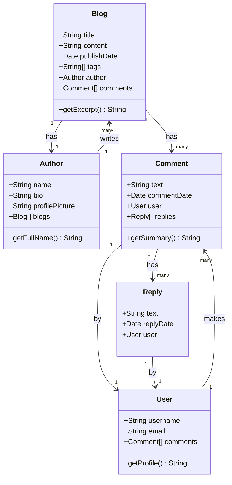
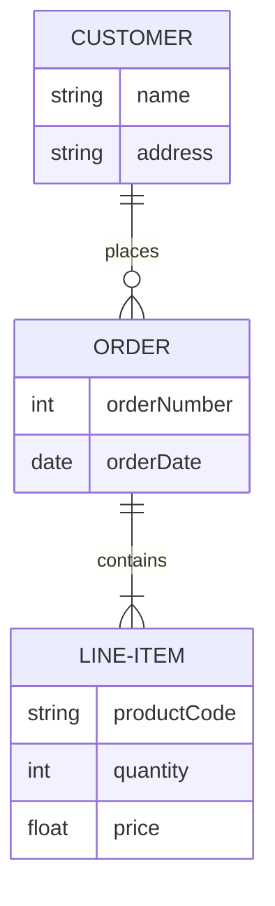
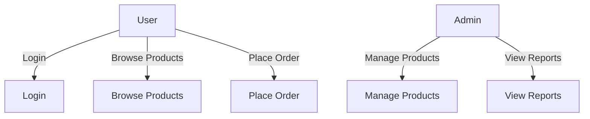
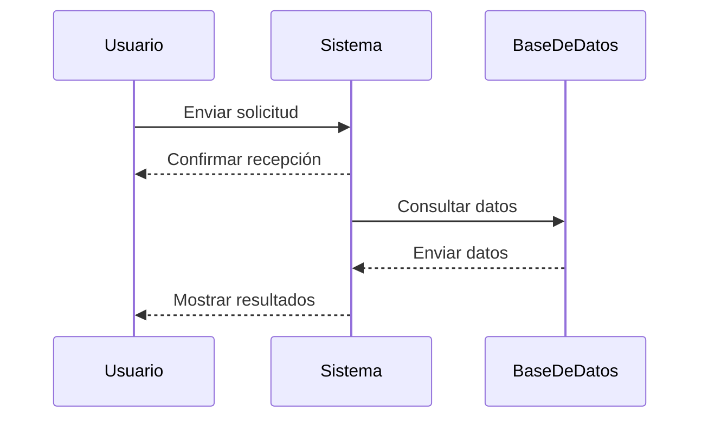
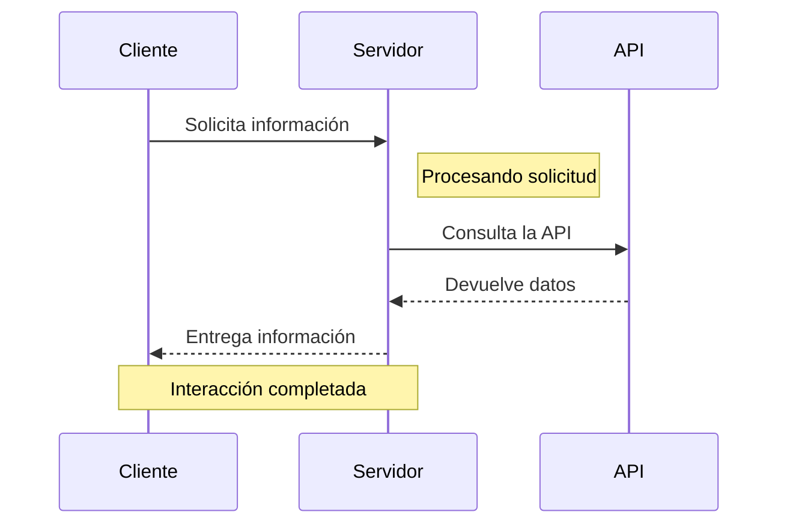
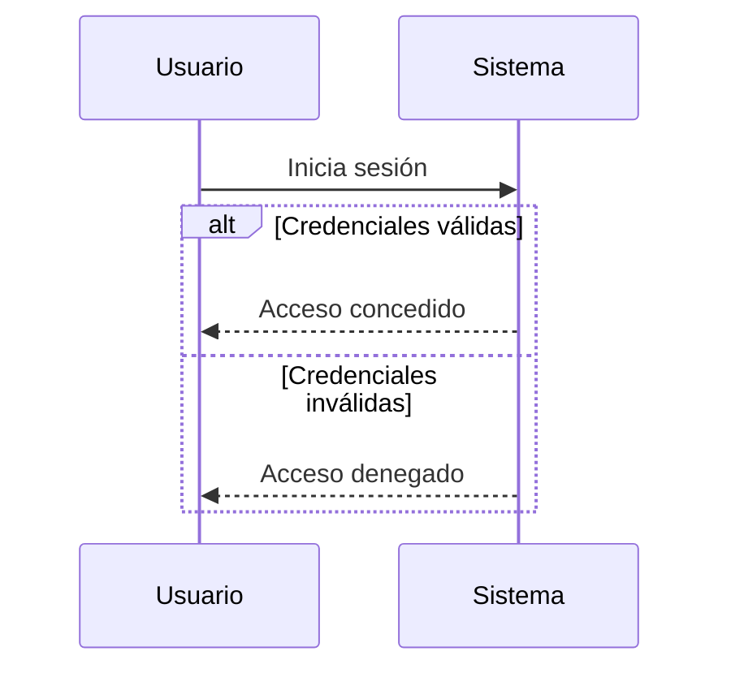

Mermaid es una herramienta poderosa que permite generar diagramas directamente desde archivos Markdown en Docusaurus. En esta guía, te mostraré cómo agregar diagramas de clases, entidad-relación (ERD) y diagramas de casos de uso en tus documentos.

<!-- truncate -->

## Diagramas de Clases

Los diagramas de clases son una representación estructural de los objetos en un sistema y sus relaciones. Aquí te muestro cómo puedes definir un diagrama de clases en Markdown usando Mermaid:

### Explicación

- **Clases**: Definimos clases como `Blog`, `Author`, `Comment`, etc., con sus atributos y métodos.
- **Relaciones**: Indicamos relaciones entre las clases con notaciones como `-->`, que muestran la multiplicidad y el tipo de relación.

## Diagramas de Entidad-Relación (ERD)

Los diagramas de entidad-relación son útiles para modelar bases de datos. Aquí hay un ejemplo básico de cómo puedes crear un ERD con Mermaid:

### Explicación

- **Entidades**: `CUSTOMER`, `ORDER`, y `LINE-ITEM` representan entidades con atributos.
- **Relaciones**: Se usa `||--o{` para mostrar la relación entre `CUSTOMER` y `ORDER`, y `||--|{` entre `ORDER` y `LINE-ITEM`.

## Diagramas de Casos de Uso

Los diagramas de casos de uso son útiles para representar las interacciones entre actores y el sistema. Aquí tienes un ejemplo sencillo:

### Explicación
- Actores: Se utilizan nodos etiquetados como actor y admin para representar los actores.
- Casos de Uso: Cada caso de uso se define como un nodo (ej. Login, Browse Products).
- Relaciones: Las flechas (-->) indican la interacción entre los actores y los casos de uso.

En Mermaid, un diagrama de interacción se puede crear utilizando un **diagrama de secuencia** (Sequence Diagram). Este tipo de diagrama es útil para representar la interacción entre diferentes objetos o entidades en un sistema a lo largo del tiempo.

### Ejemplo de Diagrama de Secuencia en Mermaid

### Explicación

- **`participant`**: Define las entidades o actores que participan en la interacción (ej. `Usuario`, `Sistema`, `BaseDeDatos`).
- **`->>`**: Representa un mensaje o acción enviada de un participante a otro.
- **`-->>`**: Representa una respuesta o retorno de un mensaje.

### Elementos Clave en Diagramas de Secuencia

- **Mensajes Sincrónicos** (`->>`): Indican que el emisor espera una respuesta antes de continuar.
- **Mensajes Asincrónicos** (`-->`): Indican que el emisor no espera una respuesta inmediata y puede continuar procesando.
- **Notas**: Puedes añadir notas al diagrama para clarificar ciertos aspectos.

### Ejemplo con Notas

### Diagrama de Secuencia con Alternativas (Opciones)

Puedes representar condiciones o alternativas usando el bloque `alt`.

- **`alt`**: Inicia un bloque de alternativas.
- **`else`**: Indica la condición alternativa dentro del bloque `alt`.

>Con estos ejemplos, puedes empezar a crear tus propios diagramas directamente en Markdown, lo que facilita la documentación de sistemas complejos y sus interacciones. Mermaid es altamente flexible y soporta muchos otros tipos de diagramas que puedes explorar para mejorar tus documentos técnicos.