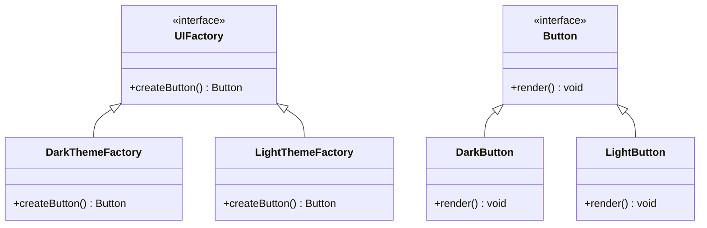
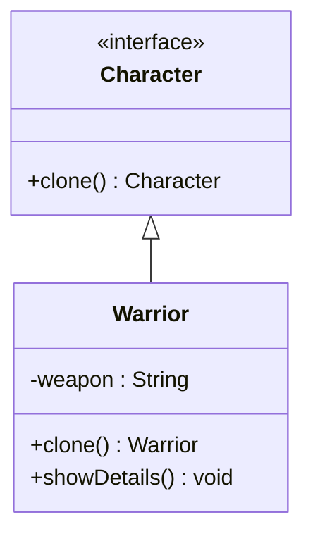
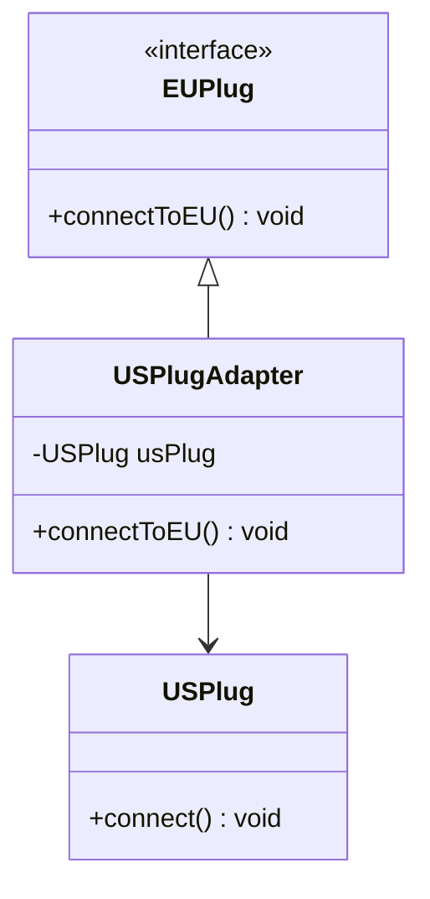
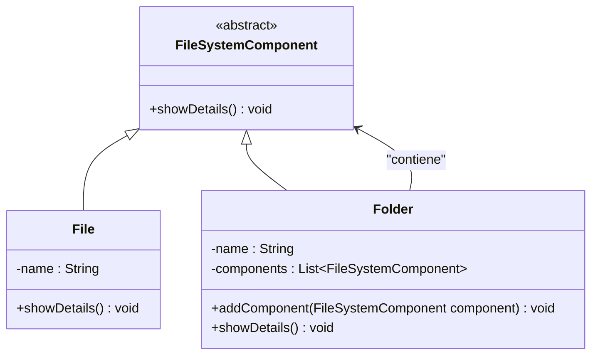
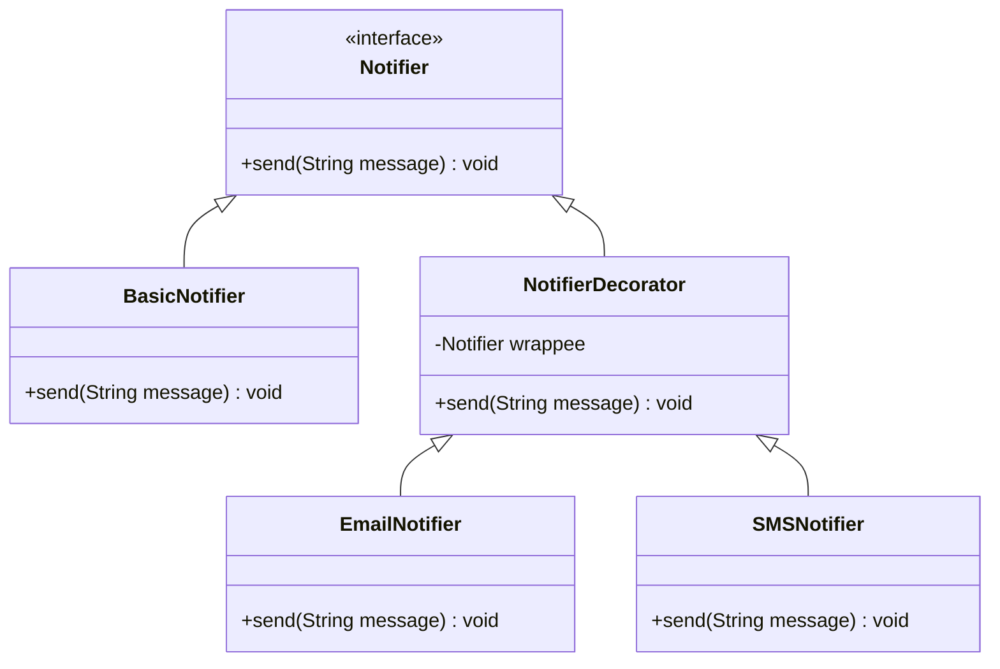

# Patrones Creacionales

Los **patrones creacionales** son una serie de técnicas que nos ayudan a manejar la creación de objetos de forma eficiente y flexible, facilitando el mantenimiento y extensión del sistema.

---

### Abstract Factory

El patrón **Abstract Factory** permite crear **familias de objetos relacionados** sin especificar sus clases concretas. Es útil cuando una aplicación necesita trabajar con distintos conjuntos de objetos que deben ser utilizados de manera conjunta.

#### Ejemplo:

Imagina que tienes una aplicación que soporta dos tipos de interfaces gráficas: una para un "tema oscuro" y otra para un "tema claro". Cada tema tiene sus propios componentes (botón, ventana, etc.).

```js
// Producto abstracto
interface Button {
    void render();
}

// Producto concreto 1
class DarkButton implements Button {
    @Override
    public void render() {
        System.out.println("Renderizando botón oscuro.");
    }
}

// Producto concreto 2
class LightButton implements Button {
    @Override
    public void render() {
        System.out.println("Renderizando botón claro.");
    }
}

// Fábrica abstracta
interface UIFactory {
    Button createButton();
}

// Fábrica concreta 1
class DarkThemeFactory implements UIFactory {
    @Override
    public Button createButton() {
        return new DarkButton();
    }
}

// Fábrica concreta 2
class LightThemeFactory implements UIFactory {
    @Override
    public Button createButton() {
        return new LightButton();
    }
}

// Cliente
class Application {
    private UIFactory factory;

    Application(UIFactory factory) {
        this.factory = factory;
    }

    void renderUI() {
        Button button = factory.createButton();
        button.render();
    }
}
```

#### Diagrama de clases (Mermaid):



---

### Prototype

El patrón **Prototype** se utiliza para crear nuevos objetos copiando una instancia existente (el prototipo), en lugar de crearlos desde cero. Esto es especialmente útil cuando la creación de objetos es costosa en términos de tiempo o recursos.

#### Ejemplo:

Imagina que estás desarrollando un juego donde todos los personajes comparten muchas características, pero con pequeñas variaciones. En lugar de crear cada personaje desde cero, puedes clonar un personaje base y luego modificar sus atributos.

```js
// Prototipo
interface Character extends Cloneable {
    Character clone();
}

// Personaje concreto
class Warrior implements Character {
    private String weapon;

    Warrior(String weapon) {
        this.weapon = weapon;
    }

    @Override
    public Character clone() {
        return new Warrior(this.weapon);
    }

    public void showDetails() {
        System.out.println("Guerrero con arma: " + weapon);
    }
}

// Cliente
class Game {
    public static void main(String[] args) {
        Warrior originalWarrior = new Warrior("Espada");
        Warrior clonedWarrior = (Warrior) originalWarrior.clone();

        originalWarrior.showDetails();
        clonedWarrior.showDetails();
    }
}
```

#### Diagrama de clases (Mermaid):



---

# Patrones Estructurales

Los **patrones estructurales** nos ayudan a estructurar clases y objetos en grandes sistemas de manera eficiente, gestionando cómo se relacionan entre sí.

---

### Adapter

El patrón **Adapter** permite que dos interfaces incompatibles trabajen juntas. Se utiliza para "adaptar" una interfaz existente a una esperada por el cliente, sin modificar el código de las clases involucradas.

#### Ejemplo:

Tienes una clase que representa un enchufe de corriente americano, pero necesitas conectarlo a un sistema europeo.

```js
// Clase existente (incompatible)
class USPlug {
    void connect() {
        System.out.println("Conectando enchufe americano.");
    }
}

// Interfaz esperada
interface EUPlug {
    void connectToEU();
}

// Adaptador
class USPlugAdapter implements EUPlug {
    private USPlug usPlug;

    USPlugAdapter(USPlug usPlug) {
        this.usPlug = usPlug;
    }

    @Override
    public void connectToEU() {
        usPlug.connect(); // Usa el enchufe americano pero lo adapta al sistema europeo
    }
}

// Cliente
class EuropeanSocket {
    void plugIn(EUPlug plug) {
        plug.connectToEU();
    }
}
```

#### Diagrama de clases (Mermaid):



---

### Composite

El patrón **Composite** permite componer objetos en estructuras de árbol para representar jerarquías del tipo "parte de" (composición). Es útil cuando queremos tratar de manera uniforme a los objetos individuales y a los grupos de objetos.

#### Ejemplo:

Imagina que estás diseñando un sistema de carpetas y archivos. Tanto las carpetas como los archivos deben poder realizar acciones como `abrir()` o `mostrarInformación()`, pero las carpetas contienen varios archivos o subcarpetas.

```js
// Componente
abstract class FileSystemComponent {
    abstract void showDetails();
}

// Hoja (componente individual)
class File extends FileSystemComponent {
    private String name;

    File(String name) {
        this.name = name;
    }

    @Override
    void showDetails() {
        System.out.println("Archivo: " + name);
    }
}

// Compuesto (grupo de componentes)
class Folder extends FileSystemComponent {
    private String name;
    private List<FileSystemComponent> components = new ArrayList<>();

    Folder(String name) {
        this.name = name;
    }

    void addComponent(FileSystemComponent component) {
        components.add(component);
    }

    @Override
    void showDetails() {
        System.out.println("Carpeta: " + name);
        for (FileSystemComponent component : components) {
            component.showDetails();
        }
    }
}
```

#### Diagrama de clases (Mermaid):



---

### Decorator

El patrón **Decorator** permite añadir responsabilidades adicionales a un objeto de manera dinámica, sin alterar su estructura ni afectar a los otros objetos de la misma clase. Es útil cuando queremos extender las funcionalidades de un objeto en tiempo de ejecución.

#### Ejemplo:

Imagina que estás desarrollando un sistema de notificaciones. Hay notificaciones básicas, pero puedes decorarlas con funcionalidades adicionales, como agregar notificaciones por email o SMS.

```js
// Componente base
interface Notifier {
    void send(String message);
}

// Componente concreto
class BasicNotifier implements Notifier {
    @Override
    public void send(String message) {
        System.out.println("Enviando notificación básica: " + message);
    }
}

// Decorador base
abstract class NotifierDecorator implements Notifier {
    protected Notifier wrappee;

    NotifierDecorator(Notifier wrappee) {
        this.wrappee = wrappee;
    }

    @Override
    public void send(String message) {
        wrappee.send(message);
    }
}

// Decorador concreto 1
class EmailNotifier extends NotifierDecorator {
    EmailNotifier(Notifier wrappee) {
        super(wrappee);
    }

    @Override
    public void send(String message) {
        super.send(message);
        System.out.println("Enviando notificación por Email: " + message);
    }
}

// Decorador concreto 2
class SMSNotifier extends NotifierDecorator {
    SMSNotifier(Notifier wrappee) {
        super(wrappee);
    }

    @Override
    public void send(String message) {
        super.send(message);
        System.out.println("Enviando notificación por SMS: " + message);
    }
}
```

#### Diagrama de clases (Mermaid):




