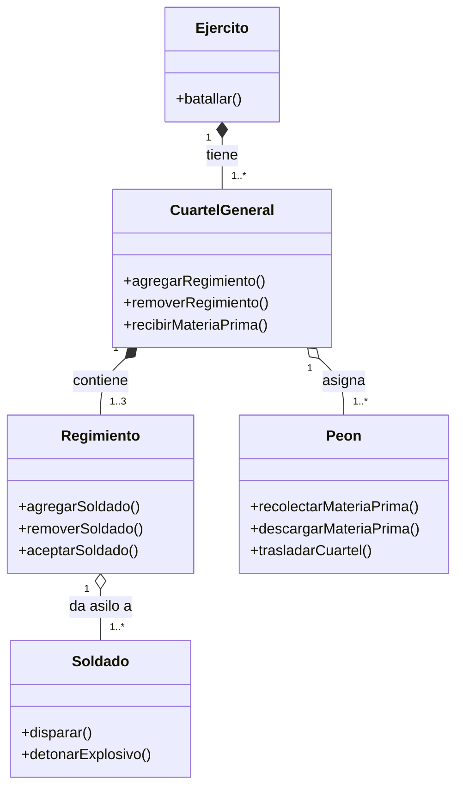
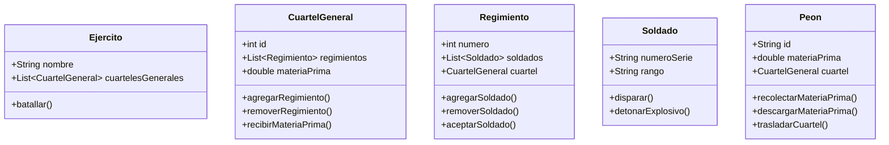

# Diseño Orientado a Objetos

## Zapp Brannigan 1.1

### Enunciado:
>Un ejército liderado por el soldado Zapp Brannigan está organizado en regimientos y cuarteles generales. Cada cuartel general puede tener a su cargo hasta 3 regimientos. Cuando la orden es dada, el ejército debe ser capaz de batallar. Esta acción implica enviar la orden de batallar a todos los cuarteles y, mediante ellos, a cada uno de los regimientos que tienen a cargo. Cada regimiento está identificado por un número, y por el cuartel general del que dependen. De hecho, un regimiento no puede crearse si no es con un cuartel general previamente designado. Los peones son los encargados de recolectar una determinada cantidad de materia prima que se le es indicada. Pueden cargar como máximo 10 kg de materia prima. Cuando estos lo deciden, descargan toda la materia prima que llevan en el cuartel general del que dependen. Esta materia será utilizada para el entrenamiento de los soldados, por lo que los cuarteles están obligados a llevar un estricto control de la cantidad disponible en todo momento. Cada peón tiene un número que lo identifica, y puede ser trasladado a un determinado cuartel, si hiciera falta. Cuando esto sucede, el soldado le indica a su cuartel de su desafectación, y notifica su ingreso al cuartel correspondiente. Los soldados son quienes pelean las batallas, por lo que pueden disparar y detonar explosivos. Los regimientos son quienes dan asilo a los soldados, que se encuentran identificados por un número de serie y un rango. Un regimiento puede expulsar o incorporar soldados en cualquier momento. Además, el cuartel general debe ser capaz de incorporar y desafectar regimientos dentro de su jurisdicción. Cuando un regimiento es desafectado, cada uno de los soldados que de él dependen, deben ser reubicados en cualquiera de los regimientos restantes. Para eso, ante la consulta con algún regimiento, este debe indicar si pueden aceptar o no a un determinado soldado, en relación a su rango.

#### Solución

#### Cuadro de Actores

| Actor               | Qué Tiene (Atributos)                                          | Qué Hace (Acciones)                                                        |
|---------------------|----------------------------------------------------------------|----------------------------------------------------------------------------|
| **Ejército**        | Zapp Brannigan, Lista de cuarteles generales                    | Batallar                                                                  |
| **Cuartel General** | Número de identificación, Lista de regimientos, Materia Prima  | Gestionar regimientos, recibir materia prima, registrar inventario          |
| **Regimiento**      | Número, Cuartel General del que depende, Lista de soldados      | Ingresar/expulsar soldados, aceptar/denegar soldados por rango              |
| **Soldado**         | Número de serie, Rango                                          | Disparar, detonar explosivos                                                |
| **Peón**            | Número de identificación, Capacidad de carga (10kg), Materia Prima cargada | Recolectar materia prima, descargar en el cuartel general, notificar traslados |

#### Diagrama Reducido (Clases y Relaciones)

En el diagrama reducido deberías tener las siguientes clases:

1. **Ejército** (agrega los cuarteles generales)
2. **Cuartel General** (agrega y gestiona regimientos, recibe materia prima de peones)
3. **Regimiento** (pertenece a un cuartel general, contiene soldados)
4. **Soldado** (pertenece a un regimiento, realiza acciones de batalla)
5. **Peón** (asignado a un cuartel general, entrega materia prima)

Las relaciones principales serían:
- **Ejército** tiene una relación de **composición** con **Cuartel General** (1 ejército a muchos cuarteles generales).
- **Cuartel General** tiene una relación de **composición** con **Regimiento** (1 cuartel a muchos regimientos, máximo 3).
- **Regimiento** tiene una relación de **agregación** con **Soldado** (1 regimiento a muchos soldados).
- **Cuartel General** tiene una relación de **agregación** con **Peón** (1 cuartel a muchos peones).

#### Diagrama Extendido (Atributos y Operaciones)

En el diagrama extendido, podrías agregar los atributos y métodos relevantes:

- **Ejército**
  - Atributos: `nombre: String`, `cuartelesGenerales: List<CuartelGeneral>`
  - Operaciones: `batallar()`

- **Cuartel General**
  - Atributos: `id: int`, `regimientos: List<Regimiento>`, `materiaPrima: double`
  - Operaciones: `agregarRegimiento()`, `removerRegimiento()`, `recibirMateriaPrima()`

- **Regimiento**
  - Atributos: `numero: int`, `soldados: List<Soldado>`, `cuartel: CuartelGeneral`
  - Operaciones: `agregarSoldado()`, `removerSoldado()`, `aceptarSoldado()`

- **Soldado**
  - Atributos: `numeroSerie: String`, `rango: String`
  - Operaciones: `disparar()`, `detonarExplosivo()`

- **Peón**
  - Atributos: `id: String`, `materiaPrima: double`, `cuartel: CuartelGeneral`
  - Operaciones: `recolectarMateriaPrima()`, `descargarMateriaPrima()`, `trasladarCuartel()`

Aquí te dejo ambos diagramas, el reducido y el extendido, utilizando la sintaxis de Mermaid.

#### Diagrama Reducido de Clases (Relaciones)

#### Diagrama Extendido de Clases (Atributos y Métodos)

