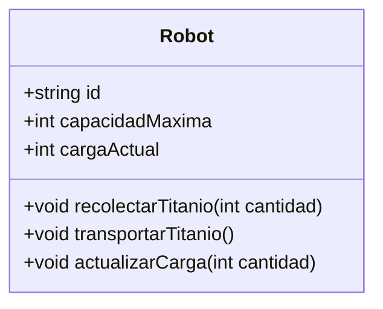

# Problema modelado clase 29/8

### Enunciado 

>La base espacial del planeta Starcraft está habitada por diferentes seres, cada uno de ellos cumpliendo un rol distinto dentro del funcionamiento de la base. Los humanos son naturalmente quienes están a cargo de la dirección. Como todos, poseen un nombre y un número de legajo. Los robots recolectores son los encargados de explorar y recolectar el titanio de los alrededores, donde cada uno posee un número de identificación. Cuentan con un compartimiento donde almacenan provisoriamente el titanio hasta dejarlo en la Fábrica de Procesamiento. 
>Los robots siempre llevan control del titanio que acarrean. El titanio crece en piedras de exactamente 10 Kilos, y los robots pueden juntar una piedra a la vez, operación que pueden realizar siempre y cuando no hayan superado su capacidad máxima de carga que es de 550 kilos. La Fábrica está dirigida por el Ingeniero Turing desde hace varios años. Cuenta con cinco contenedores, cada uno con un código de identificación y una especificación de la cantidad de toneladas que admite, así como otra con las que actualmente están ocupadas. Los robots siempre depositan el titanio en cualquier contenedor disponible.

## Resumen del Problema

La base espacial del planeta Starcraft está habitada por diferentes seres, cada uno cumpliendo un rol específico:

- **Humanos**: Dirigen la base, tienen nombre y número de legajo.
- **Robots Recolectores**: Recolectan y transportan titanio. Tienen número de identificación y un compartimiento para almacenar el titanio.
- **Titanio**: Se encuentra en piedras de 10 kilos.
- **Piedras**: Cada piedra de titanio pesa exactamente 10 kilos.
- **Fábrica de Procesamiento**: Tiene cinco contenedores para almacenar titanio, dirigidos por el Ingeniero Turing.
- **Contenedores**: Cada uno tiene un código de identificación y especifica la cantidad de toneladas que puede admitir y cuántas están ocupadas.
- **Base Espacial**: Lugar donde se encuentran todos los actores y equipos.

## Cuadro de Actores

| Actor                | Qué Tiene (Atributos)                                                        | Qué Hace (Acciones)                                         |
|----------------------|------------------------------------------------------------------------------|-------------------------------------------------------------|
| **Humanos**          | Nombre, Número de legajo                                                        | Dirigen la base                                              |
| **Robots Recolectores** | Número de identificación, Compartimiento para titanio, Capacidad máxima de carga (550 kg) | Exploran, recolectan titanio, transportan a la Fábrica de Procesamiento |
| **Titanio**          | Presente en piedras de 10 kilos                                                  | Recolectado por los robots, almacenado en contenedores      |
| **Piedras**          | Pesa 10 kilos                                                                  | Se recolectan y transportan una a la vez                   |
| **Fábrica de Procesamiento** | Cinco contenedores (cada uno con código de identificación, capacidad máxima, cantidad ocupada) | Recibe y almacena titanio                                    |
| **Contenedores**     | Código de identificación, Capacidad máxima, Cantidad ocupada                    | Almacenan titanio recolectado por los robots               |
| **Base Espacial**    | Vivienda de humanos, robots, contenedores y fábricas                           | Alberga y organiza las operaciones de la base               |

## Diagramas de clases de los actores influyentes del problema 

### Modelo de clase  `Robot`

En este modelo:

- **`id`**: Identificador del robot.
- **`capacidadMaxima`**: Capacidad máxima de carga del robot (550 kg).
- **`cargaActual`**: Cantidad actual de titanio que lleva el robot.
- **`recolectarTitanio(int cantidad)`**: Método para recolectar titanio.
- **`transportarTitanio()`**: Método para transportar el titanio a la Fábrica de Procesamiento.
- **`actualizarCarga(int cantidad)`**: Método para actualizar la cantidad de titanio que lleva.