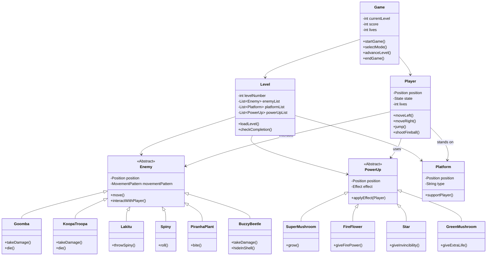
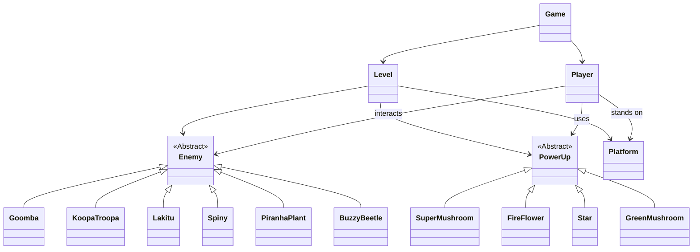

```mermaid
classDiagram
    class Game {
        -int currentLevel
        -int score
        -int lives
        +startGame()
        +selectMode()
        +advanceLevel()
        +endGame()
    }

    class Player {
        -Position position
        -State state
        -int lives
        +moveLeft()
        +moveRight()
        +jump()
        +shootFireball()
    }

    class Enemy {
        <<Abstract>>
        -Position position
        -MovementPattern movementPattern
        +move()
        +interactWithPlayer()
    }

    class Goomba {
        +takeDamage()
        +die()
    }

    class KoopaTroopa {
        +takeDamage()
        +die()
    }

    class Lakitu {
        +throwSpiny()
    }

    class Spiny {
        +roll()
    }

    class PiranhaPlant {
        +bite()
    }

    class BuzzyBeetle {
        +takeDamage()
        +hideInShell()
    }

    class PowerUp {
        <<Abstract>>
        -Position position
        -Effect effect
        +applyEffect(Player)
    }

    class SuperMushroom {
        +grow()
    }

    class FireFlower {
        +giveFirePower()
    }

    class Star {
        +giveInvincibility()
    }

    class GreenMushroom {
        +giveExtraLife()
    }

    class Platform {
        -Position position
        -String type
        +supportPlayer()
    }

    class Level {
        -int levelNumber
        -List~Enemy~ enemyList
        -List~Platform~ platformList
        -List~PowerUp~ powerUpList
        +loadLevel()
        +checkCompletion()
    }

    Game --> Player
    Game --> Level
    Level --> Enemy
    Level --> Platform
    Level --> PowerUp
    Player --> Enemy : interacts
    Player --> PowerUp : uses
    Player --> Platform : stands on

    Enemy <|-- Goomba
    Enemy <|-- KoopaTroopa
    Enemy <|-- Lakitu
    Enemy <|-- Spiny
    Enemy <|-- PiranhaPlant
    Enemy <|-- BuzzyBeetle

    PowerUp <|-- SuperMushroom
    PowerUp <|-- FireFlower
    PowerUp <|-- Star
    PowerUp <|-- GreenMushroom
```

```mermaid
classDiagram
    class Game {
    }

    class Player {
    }

    class Enemy {
        <<Abstract>>
    }

    class Goomba {

    }

    class KoopaTroopa {
    }

    class Lakitu {
    }

    class Spiny {
    }

    class PiranhaPlant {

    }

    class BuzzyBeetle {
    }

    class PowerUp {
        <<Abstract>>
    }

    class SuperMushroom {
 
    }

    class FireFlower {

    }

    class Star {

    }

    class GreenMushroom {
    }

    class Platform {
     
    }

    class Level {
    }

    Game --> Player
    Game --> Level
    Level --> Enemy
    Level --> Platform
    Level --> PowerUp
    Player --> Enemy : interacts
    Player --> PowerUp : uses
    Player --> Platform : stands on

    Enemy <|-- Goomba
    Enemy <|-- KoopaTroopa
    Enemy <|-- Lakitu
    Enemy <|-- Spiny
    Enemy <|-- PiranhaPlant
    Enemy <|-- BuzzyBeetle

    PowerUp <|-- SuperMushroom
    PowerUp <|-- FireFlower
    PowerUp <|-- Star
    PowerUp <|-- GreenMushroom
```